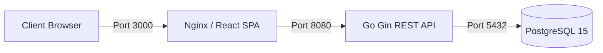

# Piggy Bank — Deployments & Production Orchestration

This folder contains container definitions and orchestration configs for self-hosting Piggy Bank in production.

---

## Architecture Overview



---

## 🚀 Quick Deployment with Docker Compose

### 1. Configure Environment
Copy `.env.example` in root or backend to set strong credentials:
```bash
export POSTGRES_PASSWORD="your_secure_db_password"
export JWT_SECRET="your_strong_random_jwt_secret_key_32_chars_min"
export ALLOWED_ORIGIN="http://yourdomain.com"
export VITE_API_URL="http://yourdomain.com:8080/api/v1"
```

### 2. Launch Services
From the `deployments` directory:
```bash
cd deployments
docker compose up -d --build
```

### 3. Verify Container Status
```bash
docker compose ps
```

- **Frontend**: Accessible on `http://localhost:3000`
- **Backend API**: Accessible on `http://localhost:8080` (Health check: `http://localhost:8080/health`)
- **Database**: PostgreSQL on `localhost:5432`

---

## 🛑 Stopping Services
```bash
docker compose down
```
To also remove database volumes:
```bash
docker compose down -v
```
