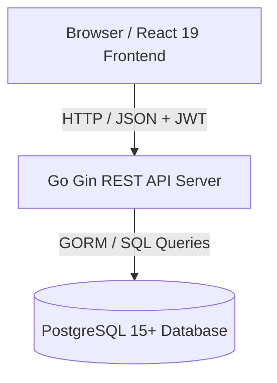
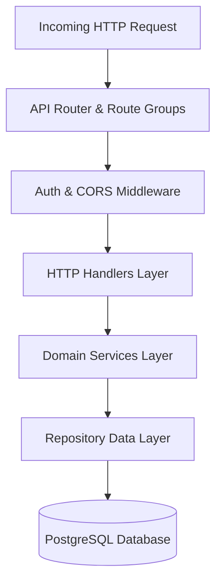
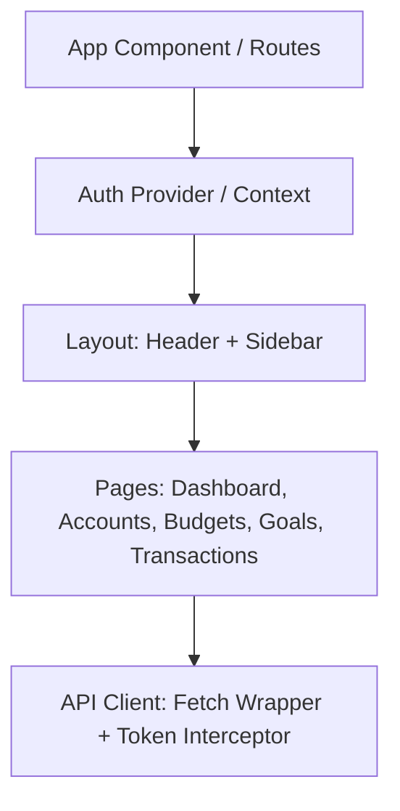
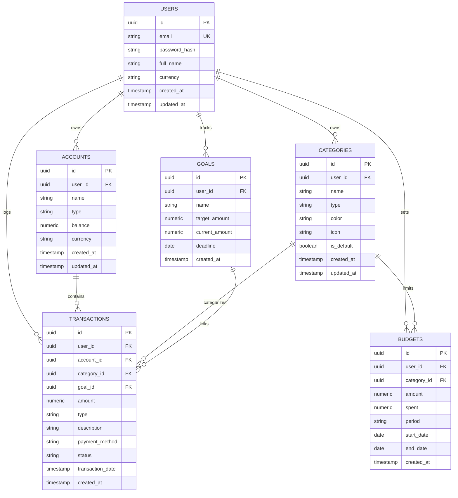

# Piggy Bank — Architecture Documentation

## System Architecture

Piggy Bank is structured as a decoupled client-server architecture consisting of a Go RESTful API backend, a PostgreSQL relational database, and a React SPA frontend.

---

## 1. Backend Architecture

The backend adheres strictly to the **Layered Clean Architecture** pattern:

### Layer Responsibilities

1. **`cmd/server/main.go`**: Application entrypoint. Loads configuration from `.env`, initializes database connection pools, sets up structured logging, configures the Gin router, and starts the HTTP server.
2. **`internal/api/router/`**: Defines public and protected route groups, mounts middleware, and registers handlers.
3. **`internal/api/middleware/`**:
   - `auth.go`: Validates JWT Bearer tokens from incoming headers and injects the authenticated `UserID` into the request context.
   - `cors.go`: Configures allowed origins, HTTP methods, and header policies.
   - `logger.go`: Logs HTTP requests, status codes, and execution latency.
4. **`internal/api/handlers/`**: Handles request binding, JSON deserialization, input validation, calls domain services, and crafts standardized HTTP responses using `internal/utils`.
5. **`internal/services/`**: Encapsulates core business rules, transactional flows, calculations (burn rate, goal completion, net worth), and report generation.
6. **`internal/repository/`**: Isolates all database operations, GORM queries, joins, and data aggregations.
7. **`internal/models/`**: Defines Go structs mapped directly to PostgreSQL tables with JSON tags and GORM constraints.
8. **`pkg/`**: Standalone computational utilities for domain-specific analytics:
   - `pkg/overview`: Aggregates active balances and calculate net worth.
   - `pkg/summary`: Calculates monthly and yearly income/expense totals and savings rates.
   - `pkg/insights`: Computes top spending categories and burn rate velocity.

---

## 2. Frontend Architecture

The frontend is a fast Single Page Application (SPA) built with React 19 and Vite.

### Component Breakdown
- **State Management & Authentication**: Centralized in `AuthProvider.jsx` and `Useauth.js`, persisting JWTs to `localStorage` and attaching Bearer headers to all authenticated HTTP requests.
- **HTTP Client**: `src/utils/Client.js` wraps standard `fetch` with token injection, unified error response handling, and automatic token refresh upon encountering 401 Unauthorized responses.
- **Routing**: Handled by `react-router-v7` with `Protectedroute.jsx` guarding all authenticated dashboard views.
- **Styling**: Tailwind CSS v4 utility classes organized under modern card-based and responsive drawer layouts.

---

## 3. Data Model & Database Schema

---

## 4. Security & Authentication Architecture

1. **Password Hashing**: Bcrypt with salt cost of 12. Plaintext passwords are never logged or stored.
2. **Token Strategy**:
   - Short-lived Access Token (JWT, default 10 minutes) containing `sub` (User ID), `email`, and `exp`.
   - Long-lived Refresh Token (JWT, default 7 days) used to request new access tokens.
3. **Multi-Tenancy & Data Isolation**: Every database query in the repository layer explicitly includes `WHERE user_id = ?`, ensuring users cannot view or mutate another user's financial records.
